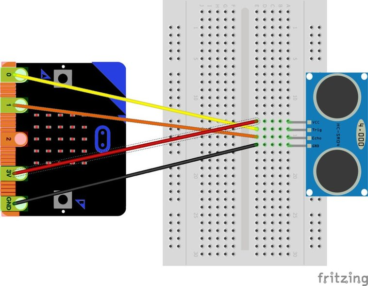
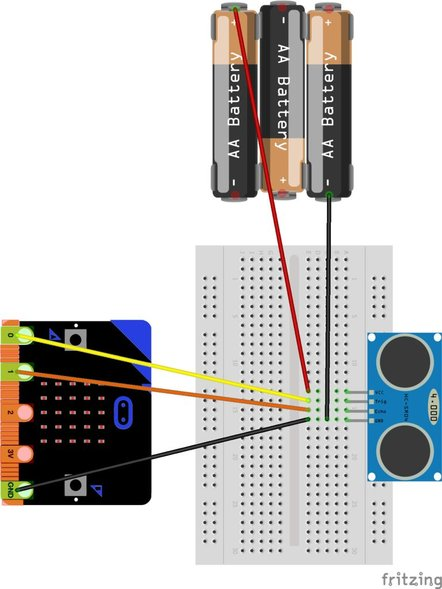

> source: https://www.instructables.com/id/Distance-Sensing-With-the-Microbit-and-Sonar-HC-SR/

# 第一步: 配置好硬件

* 设置超声波传感器非常简单，特别是使用Sparkfun传感器，因为它在3V下运行正常。
* 它只有四个pin引脚。从左到右分别是`VCC`，`Trig`，`Echo`和`GND`。
* VCC和GND用于电源，Trig，Echo和GND用于信号。
* 使用0对接Trig, 使用1对接Echo
## 注意
如果您发现没有从HC-SR04获得读数，则可能是它没有获得足够的电量，如果是这种情况，您可以为模块增加电源，如第二张图所示。
使用3节AA电池可以提供4.5V电压，这应该足够了。然后像图2一样连接所有的线
### `不要将4.5V连接到Microbit，这可能会杀死它！`

## Refer
http://www.micropython.org.cn/bbs/forum.php?mod=viewthread&tid=160
https://github.com/fizban99/microbit_hcsr04

https://gist.github.com/jimmo/14c6194578f721477c5c88e5dbbcfcef